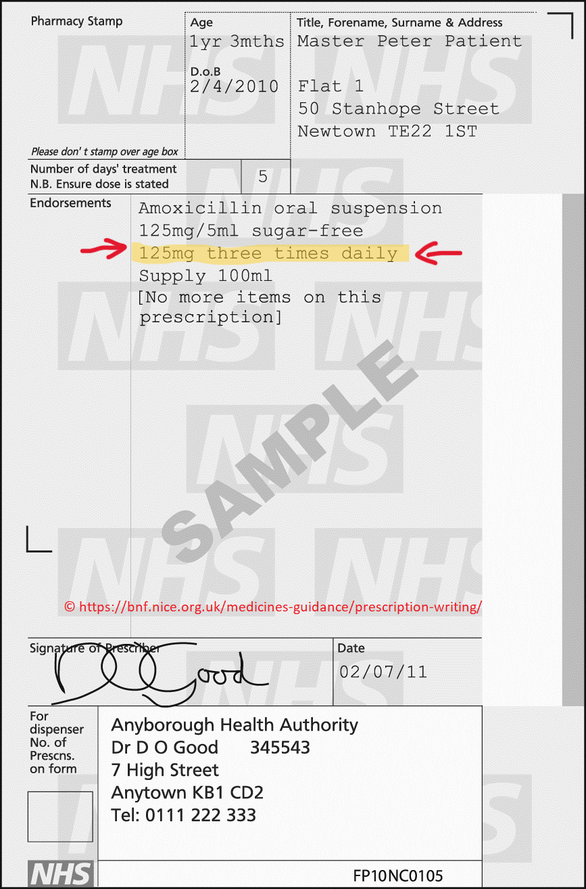

<div align="center">
  
</div>


# Dose instructions free text model and parser
> [!WARNING]
> This project is a work in progress. We do not recommend you use the code at this stage. Please contact [phs.edris@phs.scot](mailto:phs.edris@phs.scot) with any queries.

> [!TIP]
> Documentation can be found at https://public-health-scotland.github.io/dose_instruction_parser/



This repository contains code for parsing *dose instructions*. These are short pieces of 
free text written on prescriptions to tell patients how to use their medication. An example
prescription is shown to the left, with the dose instruction "*125mg three times daily*" highlighted.

The code is written primarily in Python and consists of two main phases:

1. *Named entity recognition (NER)* using a model trained via the [spacy](https://spacy.io)  package to identify phrases linked to key information, e.g. "*three times daily*" is tagged as **FREQUENCY**
2. Rules to extract structured output from the recognised entities, e.g. 
   ```python
   frequencyMin=3.0
   frequencyMax=3.0
   frequencyType='Day'
   ```

Code for **1.** can be found in the **model** folder.
Code for **2.** can be found in the **dose_instruction_parser** folder.

<br clear="left"/>

Dose instructions can be parsed from the command line in the following way:

```py
(di-dev)$ parse_dose_instructions -di "125mg three times daily"

StructuredDI(inputID=None, text='125mg three times daily', form='mg', dosageMin=125.0, dosageMax=125.0, frequencyMin=3.0, frequencyMax=3.0, frequencyType='Day', durationMin=None, durationMax=None, durationType=None, asRequired=False, asDirected=False)
```

> [!NOTE]
> Code in the **model** folder was used to generate a model for **1.** called **edris9**. This is based on the [med7](https://www.sciencedirect.com/science/article/abs/pii/S0933365721000798) [model](https://huggingface.co/kormilitzin/en_core_med7_lg/tree/main), further trained using examples specific to the prescribing information system data held by Public Health Scotland. 

## Contents

1. [File layout](#file-layout)
1. [Setup](#setup)
1. [How to train a model](#how-to-train-a-model)
1. [How to parse dose instructions](#how-to-parse-dose-instructions)

## File layout

* **set_up_conda.sh**: script to set up conda environment for development
* **environment.yaml**: environment file for development conda environment
* **secrets.env**: hidden file with location of dose instruction data filepath
* **model**: code for creating the new NER model (edris9)
    * **preprocess**
        * **tagged**: folder of tagged dose instructions in .json format produced by [spacy NER annotator](https://github.com/tecoholic/ner-annotator) desktop tool
        * **1-json_to_dat.py**: script to convert contents of **tagged** folder to .dat format for cross-checking. Output to **processed** folder.
        * **processed**: folder of processed tagged dose instructions consisting of
            * crosschecked_data: instances where tagging is consistent
            * conflicting_data: instances where tagging is not consistent
            * resolved_data: manually created file resolving the conflicting_data 
        * **2-dat_to_spacy.py**: Script to convert crosschecked and resolved data from **processed** into .spacy format, output to **model/data**
    * **config**
        * **config.cfg**: spacy configuration file to define model parameters
    * **train_model.sh**: bash script to train model using config file and data in **data** folder
    * **evaluate_model.sh**: bash script to evaluate model performance using precision, recall and F-score
    * **package_model.sh**: bash script to package model
* **dose_instruction_parser**: package for parsing dose instructions. See internal **README.md** for more detailed information.
* **benchmark**: scripts for benchmarking against prolog code


## Setup

### Model development set up

1. Clone repository
1. Obtain **secrets.env** file from colleagues which defines environment variable **DI_FILEPATH**. If you are working outwith Public Health Scotland you can define your own filepath and start the process from scratch.
1. Run  `./set_up_conda.sh` to set up the conda environment (default name **di**)
1. Activate environment with e.g. `conda activate di`

### Package development set up

1. Clone repository
1. Obtain **secrets.env** file from colleagues which defines environment variable **DI_FILEPATH**. If you are working outwith Public Health Scotland you can define your own filepath and start the process from scratch.
1. Create new conda environment: `conda create -n di-dev`
1. Activate environment: `conda activate di-dev`
1. Install package using editable pip install and development dependencies: `python -m pip install -e dose_instruction_parser[dev]`
1. Run `parse_dose_instructions` on command line and/or get developing

## How to train a model

1. Follow [model development setup](#model-development-set-up)
1. Go to **model** folder
1. Tag data using desktop [NER annotator tool](https://tecoholic.github.io/ner-annotator/) 
1. Copy output to **preprocess/tagged** as .json. Only put files here which you want to train the model on.
1. Run **preprocess/1-json_to_dat.py**. This takes the tagged data and crosschecks all unique dose instructions against the different tags which were given to them. Any where all tags agree are outputted to **preprocess/processed/crosschecked_data.dat**. Those where tags conflict are outputted to **preprocess/processed/conflicting_data.dat**
1. Make a copy of **conflicting_data.dat** and save as **resolved_data.dat**. Remove the instances of tags you don't want.
1. Run **preprocess/2-dat_to_spacy.py**. This loads in the crosschecked data and resolved data and converts to spacy format. Output is saved in **model/data**
1. Check the config file: **config/config.cfg**
1. Train model using `./train_model.sh`. Takes about 3 hours to run ~2k examples
1. Model results are saved at the **DI_FILEPATH**. There is a best fit model (model-best) and also the last model tested (model-last).
1. Evaluate your model results based on precision, recall and F-score using `./evalute_model.sh`. Output at **DI_FILEPATH** in **logs**.
1. You can compare and visualise model results by adapting the python script **compare_models.py**
1. Convert your model to a package by running `./package_model.sh`
1. Install your model using pip and specifying the path to the model

## How to parse dose instructions

See the **README.md** in **dose_instruction_parser** for information on parsing dose instructions and developing the parser code.
